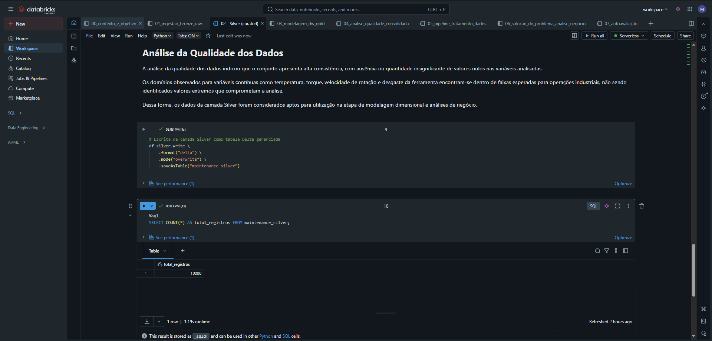
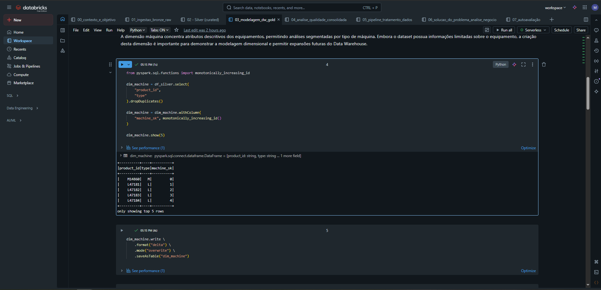
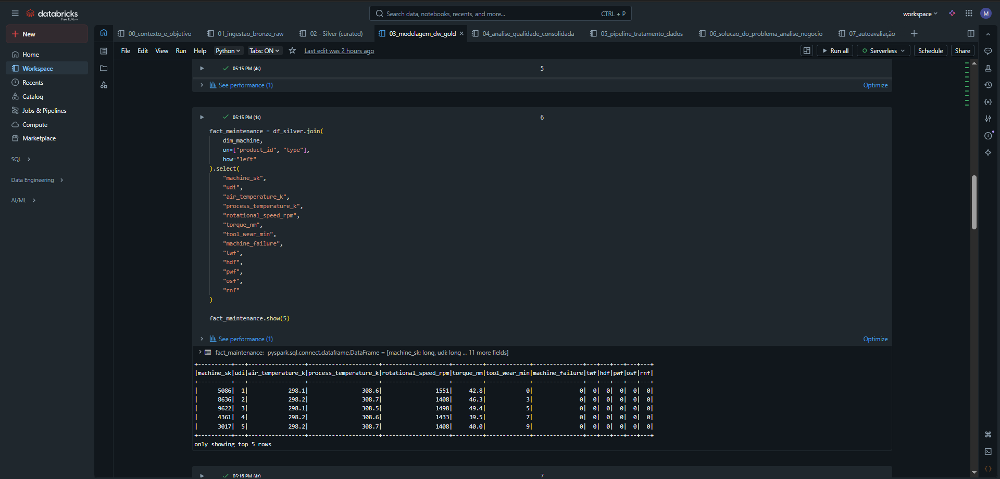
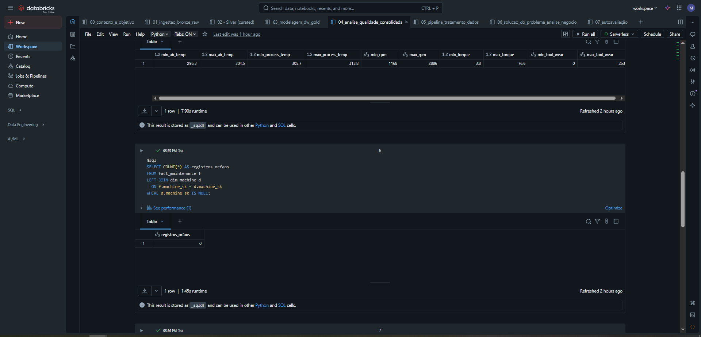
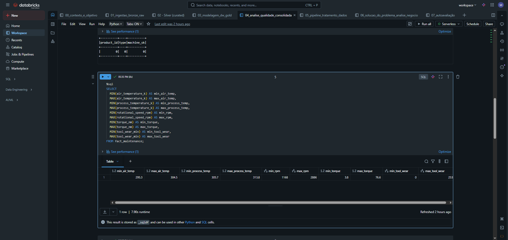
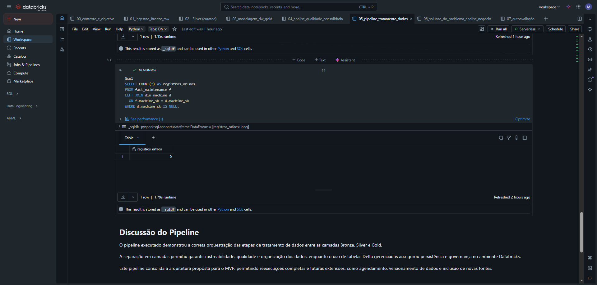

# MVP_Engenharia_de_dados_Maykon_Rodrigues_4025025000400

Nome: Maykon Jhonata Rodrigues

Matrícula: 4025025000400

Dataset: AI4I 2020 Predictive Maintenance Dataset

Este projeto tem como objetivo aplicar técnicas de análise exploratória e pré-processamento de dados a um conjunto realista e relevante do setor industrial, com foco em manutenção preditiva de máquinas.

Este repositório apresenta o desenvolvimento de um **MVP de Engenharia de Dados**, cujo objetivo foi construir um pipeline completo de dados em nuvem, contemplando as etapas de **busca, coleta, modelagem, carga e análise**, utilizando a plataforma **Databricks Community Edition** e a tecnologia **Delta Lake**.

O projeto utiliza um conjunto de dados de **manutenção preditiva de equipamentos industriais**, permitindo a análise de falhas e a estruturação de um **Data Warehouse em modelo estrela**, com foco em suporte à tomada de decisão.

---

## 🎯 Objetivo do MVP

O objetivo principal deste MVP foi responder às seguintes perguntas de negócio:

1. Quais variáveis operacionais estão mais associadas à ocorrência de falhas?
2. Existem padrões operacionais relacionados a falhas em equipamentos?
3. Quais tipos de falha ocorrem com maior frequência?
4. Existem tipos de máquinas mais suscetíveis a falhas?

Para atingir esses objetivos, foi desenvolvido um pipeline de dados estruturado em camadas (**Bronze, Silver e Gold**), garantindo rastreabilidade, qualidade e organização dos dados.

---

## 🧱 Arquitetura do Projeto

A arquitetura do pipeline segue o padrão de camadas amplamente utilizado em projetos de engenharia de dados:

Fonte de Dados (CSV – Kaggle)
↓
Camada RAW (Upload manual – Databricks)
↓
Camada Bronze (Delta Lake – dados brutos)
↓
Camada Silver (Delta Lake – dados tratados)
↓
Camada Gold (Data Warehouse – modelo estrela)

---

## 📂 Organização dos Notebooks

| Notebook | Descrição |
|--------|----------|
| `00_contexto_e_objetivo` | Contextualização do problema e definição das perguntas de negócio |
| `01_ingestao_bronze_raw` | Coleta e ingestão dos dados na camada Bronze |
| `02_silver_curated` | Tratamento, padronização e curadoria dos dados (Silver) |
| `03_modelagem_dw_gold` | Modelagem analítica e construção do Data Warehouse (Gold) |
| `04_analise_qualidade_consolidada` | Análise consolidada da qualidade dos dados |
| `05_pipeline_tratamento_dados` | Pipeline consolidado Bronze → Silver → Gold |
| `06_solucao_do_problema_analise_negocio` | Solução do problema e análise de negócio |
| `07_autoavaliacao` | Autoavaliação do desenvolvimento do MVP |

---

## 📸 Evidências da Execução do MVP

### Ingestão dos Dados

**Figura 1 – Upload do conjunto de dados no Databricks.**  
O arquivo CSV foi carregado manualmente na plataforma Databricks Community Edition.

---

**Figura 2 – Criação da tabela RAW.**  
Tabela criada a partir do arquivo CSV utilizando a interface gráfica do Databricks.

---

### Camadas Bronze e Silver

**Figura 3 – Persistência da camada Bronze em Delta Lake.**  
Os dados brutos foram armazenados como tabela Delta gerenciada.

---

**Figura 4 – Persistência da camada Silver em Delta Lake.**  
Dados tratados, padronizados e preparados para análise.

---

### Modelagem Analítica – Camada Gold

**Figura 5 – Dimensão de máquinas (`dim_machine`).**  
Tabela de dimensão contendo chave substituta e atributos descritivos.

---

**Figura 6 – Tabela fato de manutenção (`fact_maintenance`).**  
Tabela fato contendo métricas operacionais e indicadores de falha.

---

### Análise de Qualidade dos Dados

**Figura 7 – Verificação de integridade referencial.**  
Análise indicando ausência de registros órfãos entre fato e dimensão.

---

**Figura 11 – Validação dos domínios dos atributos.**  
Verificação de valores mínimos e máximos das variáveis operacionais.

---

### Pipeline de Tratamento de Dados

**Figura 8 – Execução do pipeline de tratamento de dados.**  
Pipeline consolidado executando o fluxo completo entre as camadas Bronze, Silver e Gold.

---

### Solução do Problema – Análise de Negócio

**Figura 9 – Comparação de variáveis operacionais em cenários de falha e operação normal.**

---

**Figura 12 – Taxa média de falha por tipo de máquina.**  
Análise segmentada por tipo de equipamento.

---

### Autoavaliação

**Figura 13 – Autoavaliação do MVP.**  
Reflexão final sobre o atingimento dos objetivos, dificuldades encontradas e possibilidades de evolução do projeto.

---

## ⚙️ Tecnologias Utilizadas

- Databricks Community Edition  
- Apache Spark (PySpark)  
- Delta Lake  
- SQL  
- GitHub  

---

## 🧠 Autoavaliação (Resumo)

Os objetivos do MVP foram atingidos com sucesso, sendo possível estruturar um pipeline completo de dados em nuvem, realizar análises de qualidade e responder às perguntas de negócio propostas.

As principais dificuldades estiveram relacionadas às limitações do Databricks Community Edition, especialmente quanto à persistência em diretórios do DBFS e à ausência de mecanismos nativos de automação. Essas limitações foram contornadas por meio do uso de tabelas Delta gerenciadas e execução manual e reexecutável do pipeline.

Como trabalhos futuros, destacam-se a automação do pipeline em ambientes produtivos, a integração com novas fontes de dados e a aplicação de modelos de machine learning para predição de falhas.

---

## 📌 Considerações Finais

Este MVP demonstra a aplicação prática de conceitos de engenharia de dados, pipelines em nuvem, qualidade de dados e modelagem analítica. A solução desenvolvida evidencia como arquiteturas baseadas em camadas e Data Warehouse podem apoiar a tomada de decisão baseada em dados no contexto industrial.

