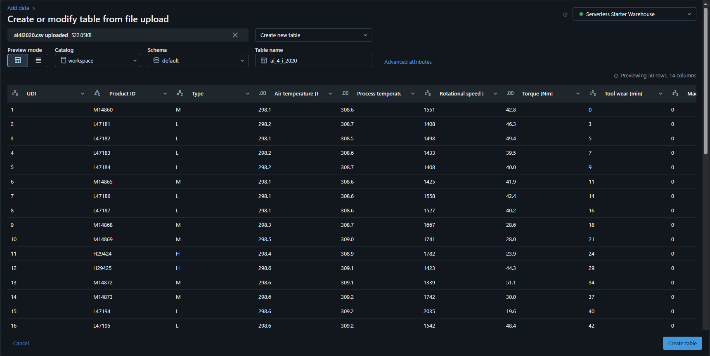
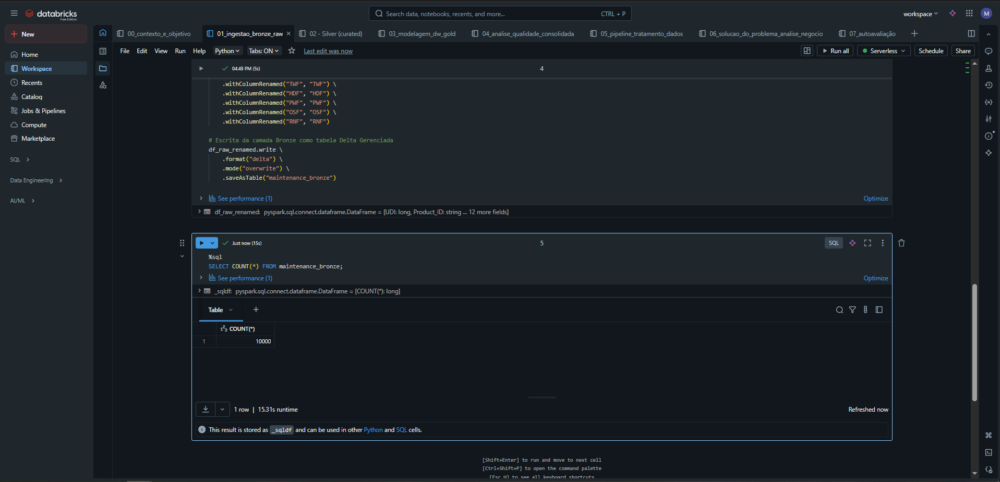
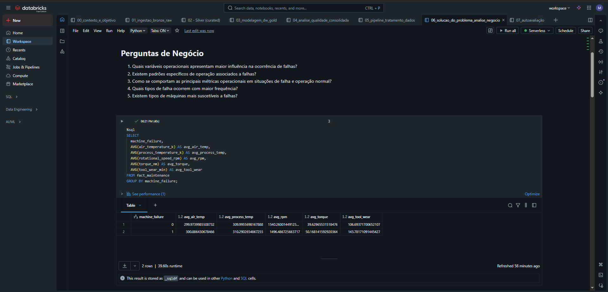
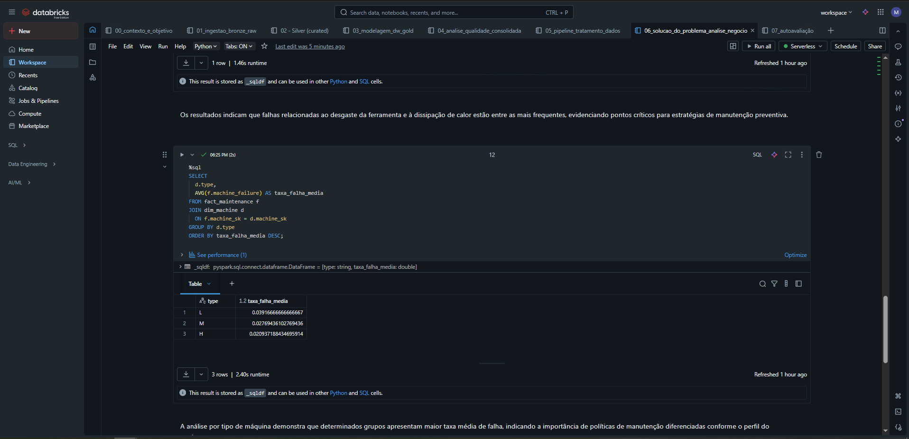

# MVP – Engenharia de Dados  
**Aluno:** Maykon Jhonata Rodrigues  
**Matrícula:** 4025025000400  
**Dataset:** AI4I 2020 Predictive Maintenance  

Este projeto apresenta o desenvolvimento de um **MVP de Engenharia de Dados**, cujo objetivo foi construir um **pipeline completo de dados em nuvem**, contemplando ingestão, tratamento, modelagem, carga e análise de dados, utilizando **Databricks Community Edition** e **Delta Lake**.

O conjunto de dados utilizado refere-se à **manutenção preditiva de equipamentos industriais**, permitindo a análise de falhas e a construção de um **Data Warehouse em modelo estrela**, voltado ao suporte à tomada de decisão.

---

## Objetivo do MVP

Responder às seguintes perguntas de negócio:

1. Quais variáveis operacionais estão mais associadas à ocorrência de falhas?
2. Existem padrões operacionais relacionados a falhas?
3. Quais tipos de falha ocorrem com maior frequência?
4. Existem tipos de máquinas mais suscetíveis a falhas?

Para isso, foi desenvolvido um pipeline estruturado em camadas **Bronze, Silver e Gold**.

---

## Arquitetura do Pipeline

CSV (Kaggle)
→ RAW (Upload Databricks)
→ Bronze (Delta Lake)
→ Silver (Delta Lake)
→ Gold (Data Warehouse – Modelo Estrela)

---

## 📂 Organização dos Notebooks

| Ordem | Notebook | Descrição |
|---|---|---|
| 00 | Contexto e Objetivo | Definição do problema e perguntas de negócio |
| 01 | Ingestão Bronze | Ingestão e persistência dos dados brutos |
| 02 | Silver | Tratamento e padronização dos dados |
| 03 | Gold | Modelagem dimensional (DW) |
| 04 | Qualidade | Análise consolidada da qualidade dos dados |
| 05 | Pipeline | Pipeline completo Bronze → Gold |
| 06 | Solução | Análise de negócio e insights |
| 07 | Autoavaliação | Avaliação final do MVP |

---

## 📸 Evidências da Execução

### Ingestão e Persistência dos Dados

  
**Figura 1 – Upload do dataset no Databricks.**

  
**Figura 2 – Criação da tabela RAW.**

  
**Figura 3 – Persistência da camada Bronze.**

  
**Figura 4 – Persistência da camada Silver.**

---

### Modelagem Analítica (Gold)

  
**Figura 5 – Dimensão `dim_machine`.**

  
**Figura 6 – Tabela fato `fact_maintenance`.**

---

### Qualidade e Pipeline

  
**Figura 7 – Integridade referencial validada.**

  
**Figura 8 – Execução do pipeline completo.**

---

### Análise de Negócio

  
**Figura 9 – Variáveis operacionais em cenários de falha.**

  
**Figura 10 – Taxa de falha por tipo de máquina.**

---

## ⚙️ Tecnologias Utilizadas

- Databricks Community Edition  
- Apache Spark (PySpark)  
- Delta Lake  
- SQL  
- GitHub  

---

## 📌 Considerações Finais

O MVP atingiu seus objetivos ao demonstrar a construção de um pipeline de dados em nuvem, a aplicação de boas práticas de engenharia de dados e a obtenção de insights relevantes para manutenção preditiva. A solução evidencia como arquiteturas em camadas e modelagem dimensional podem apoiar decisões baseadas em dados no contexto industrial.
